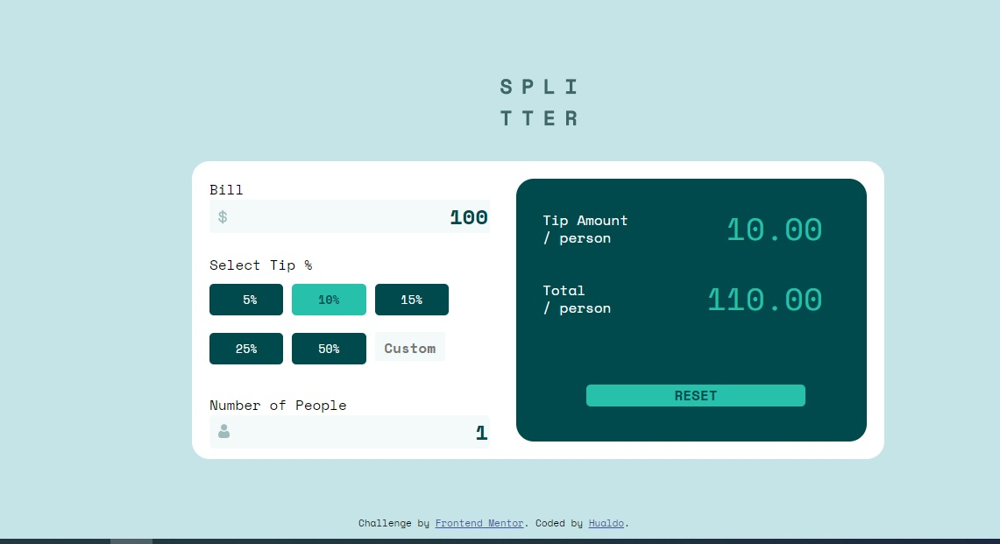

# Frontend Mentor - Tip calculator app solution

This is a solution to the [Tip calculator app challenge on Frontend Mentor](https://www.frontendmentor.io/challenges/tip-calculator-app-ugJNGbJUX). Frontend Mentor challenges help you improve your coding skills by building realistic projects.

## Table of contents

- [Overview](#overview)
  - [The challenge](#the-challenge)
  - [Screenshot](#screenshot)
  - [Links](#links)
- [My process](#my-process)
  - [Built with](#built-with)
  - [What I learned](#what-i-learned)
  - [Continued development](#continued-development)
- [Author](#author)

## Overview

With this challenge, I,ve tried to apply my knowledge about CSS3, HTML5 and Java Script Vanilla.

### The challenge

Users should be able to:

- View the optimal layout for the app depending on their device's screen size
- See hover states for all interactive elements on the page
- Calculate the correct tip and total cost of the bill per person

### Screenshot

### Links

- Solution URL: [Add solution URL here](https://github.com/Hualdop/tipCalculatorApp)
- Live Site URL: [Add live site URL here](https://hualdop.github.io/tipCalculatorApp/)

## My process

The process to solve this challenge was: in first time I user HTML to ubicate all the elements and then with CSS I disigned the best performance of the elements and finally with JS I calculate the tip and the cost of the bill per person.

### Built with

- Semantic HTML5 markup
- CSS custom properties
- Flexbox
- Mobile-first workflow

### What I learned

With this challenge I learned about Flexbox and the DOM JS. I improve my knowledge in CSS, very special in Flexbox

### Continued development

I´d like to continue improve about Flexbox and Grid, I hope deepen my knowledge in JS

## Author

- Website - [Hualdo](https://hualdop.github.io/Hualcap/)
- Frontend Mentor - [@Hualdop](https://www.frontendmentor.io/profile/Hualdop)
- Twitter - [@Hualdos](https://www.twitter.com/hualdos)

